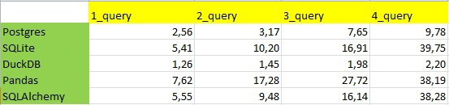
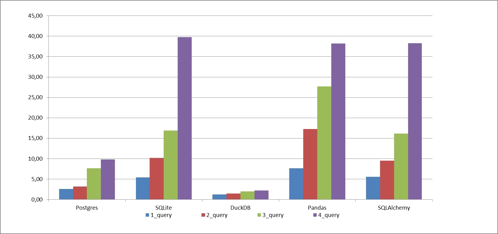

# Benchmark - DataBase Lab 3
## Основная информация
В лабораторной работе был реализован бенчмарк [4queries](https://medium.unum.cloud/pandas-cudf-modin-arrow-spark-and-a-billion-taxi-rides-f85973bfafd5),
для замера производительности 5 библиотек</br>(`Psycopg2`, `SQLite`,`DuckDB`,`Pandas`,`SQLAlchemy`) на 4 SQL запросах.

</br>В качестве языка был выбран `Python` из-за его удобства работы с базами данных и простого синтаксиса.
</br>Для Psycorg2 был выбран файл `nyc_yellow_tiny.csv`, так как Psycorg2 плохо работает с большими файлами.
</br>Для всех остальных библиотек был выбран файл `nyc_yellow_big.csv`, с помощью которого была создана база данных `postgres.db`
</br>ТЗ и выборки данных можно найти [тут](https://drive.google.com/drive/folders/1usY-4CxLIz_8izBB9uAbg-JQEKSkPMg6).
## Запуск проекта
Для работы с библиотеками необходимо выполнить команду в терминале:
```
pip install -r settings.txt
```
**_</ins>Для работы с psycopg2 версия python должна быть меньше 3.10</ins>_**

</br>Далее необходимо установить [папку](https://drive.google.com/drive/folders/1XUNdFTeCnMS-xKpYOBzKa55ifRUSzXE4?usp=sharing) с базой данных в проект.
## Библиотеки
### Psycorg2


Предоставляет низкоуровневый доступ к базе данных, позволяя выполнять SQL-запросы, управлять транзакциями и работать с различными типами данных. `Psycopg2` обеспечивает высокую производительность и надежность при взаимодействии с `PostgreSQL` и широко используется в различных проектах.

</br>Использование:
```py
import psycopg2

conn = psycopg2.connect(database="dbname", user="username", password="password", host="hostname", port="portnum")  # соединение с базой данных
# в нашем случае - psycopg2.connect(database="postgres", user="postgres", password="postgres", host="localhost", port="5432")

cursor = conn.cursor() 
cursor.execute("SQL-query") # выполнение SQL запроса
conn.commit() # запись в базу данных
cursor.close() 
conn.close()
```
### SQLite


`SQLite` – это компактная, встраиваемая реляционная база данных, которая не требует отдельного сервера для своей работы. Она поддерживает стандартный набор SQL команд и обладает высокой производительностью. `SQLite` хранит всю базу данных в одном файле, что делает ее удобной для встраивания в приложения.

</br>Использование:
```py
import sqlite3

conn = sqlite3.connect("dbname.db")  # соединение с базой данных, в нашем случае - connect("db/postgres.db")

cursor = conn.cursor() 
cursor.execute("SQL-query") # выполнение SQL запроса
conn.commit() # запись в базу данных
cursor.close() 
conn.close()
```
### DuckDB


`DuckDB` - это аналитическая база данных с открытым исходным кодом, которая разрабатывается для эффективной обработки аналитических запросов. Она предназначена для использования в приложениях, требующих быстрых запросов и аналитики на больших объемах данных. `DuckDB` поддерживает стандарт SQL и может работать как в режиме встроенной библиотеки, так и в режиме сервера. Основные принципы проектирования `DuckDB` включают высокую производительность, низкую задержку запросов и малый объем памяти, необходимый для работы.

</br>Использование:
```py
import duckdb

conn = sqlite3.connect("dbname.db")  # соединение с базой данных, также поддерживается соединение с "dbname.duckdb"

cursor = conn.cursor() 
cursor.execute("SQL-query") # выполнение SQL запроса
cursor.close() 
conn.close()
```
### Pandas


Библиотека `Pandas` в Python предоставляет мощные инструменты для работы с данными в виде двумерных таблиц, известных как DataFrame. В контексте баз данных, `Pandas` может использоваться для загрузки данных из различных источников, включая реляционные базы данных через SQL-запросы. Она обеспечивает удобные методы для фильтрации, агрегации и манипуляций с данными, что делает ее популярным выбором для анализа и обработки данных из баз данных в научных и коммерческих приложениях.

</br>Использование:
```py
import psycopg2
import sqlite3
import duckdb
import pandas as pd
from sqlalchemy import create_engine

# 1 способ
conn = sqlite3.connect("dbname.db") # также можем подключиться с помощью psycorg2 или duckdb

# 2 способ
conn = create_engine("dialect+driver//username:password@hostname:portnum/dbname")
# или
conn = create_engine('sqlite:///dbname.db')

pd.read_sql("SQL query", conn) # выполнение SQL запроса
```
### SQLAlchemy


Библиотека `SQLAlchemy` в Python представляет собой мощный инструмент для взаимодействия с реляционными базами данных. Она предоставляет высокоуровневый API для создания, управления и выполнения SQL-запросов в базах данных, а также абстрагирует детали работы с различными системами управления базами данных (СУБД). `SQLAlchemy` позволяет создавать объектные отображения, что упрощает работу с данными, а также обеспечивает мощные средства для создания сложных SQL-выражений. Эта библиотека часто используется при разработке веб-приложений и других проектов, где требуется эффективное взаимодействие с базами данных.

</br>Использование:
```py
from sqlalchemy import create_engine, text
from sqlalchemy.orm import sessionmaker

conn = create_engine("dialect+driver//username:password@hostname:portnum/dbname")
# или
conn = create_engine('sqlite:///dbname.db')

session = sessionmaker(bind=conn)()
session.execute(text("SQL-query")) # SQLalchemy работает только с text в execute
session.close()
engine.dispose()
```
## Результаты
Таблица производительности библиотек:



Сравнение времени работы (в секундах) в виде графика:


## Впечатления о библиотеках
### Psycorg2
Вторая по скорости выполнения запросов библиотека, позволяет легко и быстро выполнять различные действия в Python или pgAdmin
</br>При этом, загрузка в `Postgres` происходит достаточно долго по сравнению с работой `SQLite` и файлом `postgres.db`
</br>Требует некоторой предварительной настройки, но обладает хорошей документацией и обширным сообществом пользователей.
### SQLite
Библиотека, которая не требует отдельного сервера для работы, проста в установке и использовании.
</br>Она является популярным выбором для небольших проектов или приложений, где требуется локальное хранение данных.
</br>Главным минусом является низкая скорость выполнения запросов, особенно при работе с большими объемами данных, а также ограниченная поддержка некоторых функций и типов данных
### DuckDB
Самая быстрая библиотека, спроектированная для работы с большими объемами данных и выполнения сложных аналитических запросов. Она обладает высокой производительностью и хорошо подходит для аналитических задач.
</br>Также как и `SQLite` проста в установке и использовании.
</br>Из минусов:
</br>- Меньшее сообщество пользователей по сравнению с более популярными базами данных.
</br>- Может потребоваться дополнительное изучение для эффективного использования.
### Pandas
Популярная библиотека, предназначенная для анализа и манипуляции данных. Она обладает широкими возможностями для работы с табличными данными, но не всегда оптимальна для выполнения больших объемов запросов к базам данных.
</br>Минус - относительно низкая скорость выполнения запросов, особенно при работе с большими объемами данных.
### SQLAlchemy
Библиотека Python, предоставляющая возможность взаимодействия с различными системами управления базами данных через SQL. `SQLAlchemy` обладает богатыми возможностями и гибкостью, но может быть сложна для новичков.
</br>Поддерживает различные СУБД, с возможностью `ORM`.
> [!NOTE]
> ORM позволяет управлять базами данных с помощью методов объектов в коде и при этом не использовать SQL-запросы.

</br>Скорость выполнения запросов в различных библиотеках может зависеть от нескольких факторов:

* **_</ins>Тип базы данных:</ins>_**
</br>Некоторые библиотеки могут быть оптимизированы для работы с определенными типами баз данных. Например, `DuckDB` специализируется на аналитических запросах, поэтому показывает высокую производительность при выполнении сложных аналитических запросов. В то время как библиотеки, такие как `Psycopg2` и `SQLAlchemy`, могут быть более универсальными, что может повлиять на скорость выполнения запросов в зависимости от конкретной базы данных.

* **_</ins>Объем данных:</ins>_**
</br>Скорость выполнения запросов также зависит от объема данных, с которым библиотека работает. Некоторые библиотеки,например `Psycorg2`, могут показывать хорошую производительность при работе с небольшими объемами данных, но могут замедляться при обработке больших объемов.

* **_</ins>Оптимизация запросов:</ins>_**
</br>Эффективность выполнения запросов может зависеть от того, насколько хорошо запросы оптимизированы. Например, использование индексов, правильная структура таблиц и оптимальные запросы могут существенно повлиять на скорость выполнения запросов.

* **_</ins>Уровень оптимизации и сложности библиотеки:</ins>_**
</br>Некоторые библиотеки могут быть более оптимизированы и эффективны в своей работе, в то время как другие могут предлагать более широкий набор функций и гибкость, что может сказаться на скорости выполнения запросов.
## Выводы
Был написан бенчмарк для измерения производительности 5 различных библиотек на 4 SQL запросах. 
</br>Самой быстрой оказалась `DuckDB`, отработав в несколько раз быстрее других библиотек. 
</br>Далее в топе производительных идет библиотека `Psycopg2`,она проигрывает `DuckDB`, из-за своей реляционной структуры базы данных, начиная обработку с первой строки и просматривая всю таблицу для нахождения нужных данных. Тем не менее, `PostgreSQL` является сравнительно оптимизированной СУБД и вследствие чего имеет достаточно высокую производительность.
</br>`SQLite`, несмотря на свою простоту, показала худший результат из-за неоптимизированной работы с большими объёмами данных. 
</br>Оставшиеся библиотеки были подключены к `postgres.db` и показали примерно одинаковый, не особо хороший результат, это связано с тем, что они обладают большим кол-вом инструментов и возможностей.
